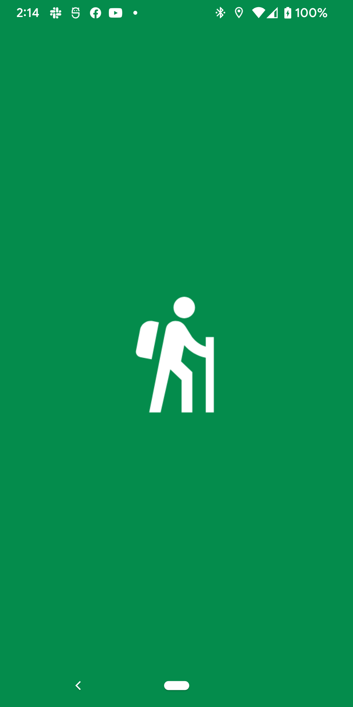
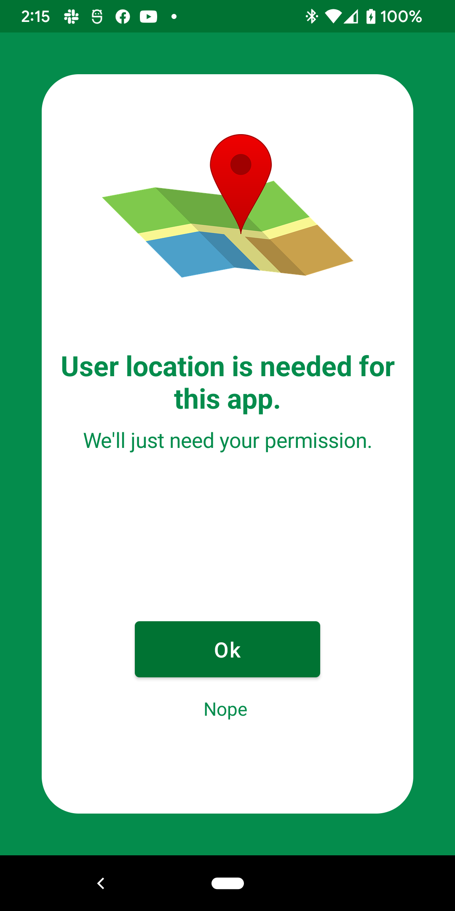
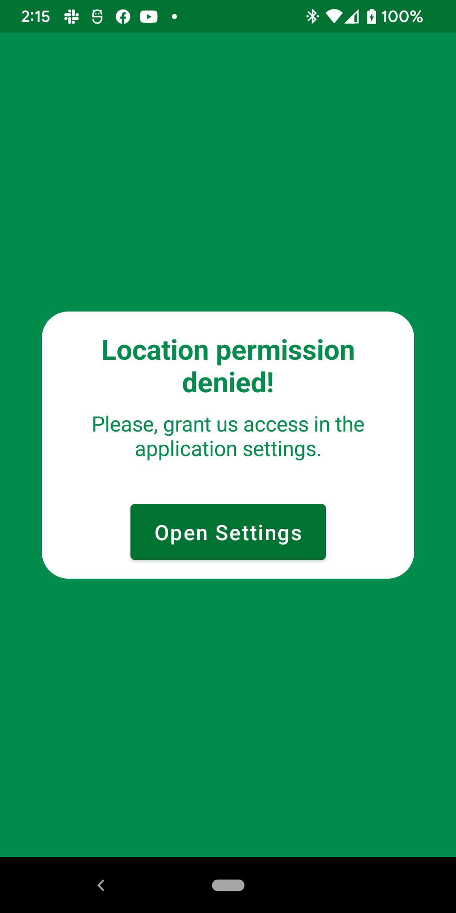
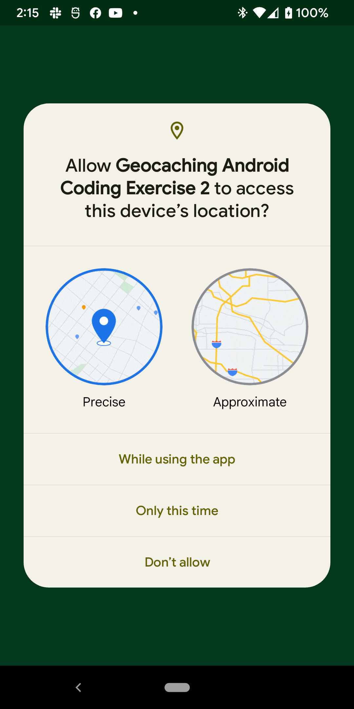
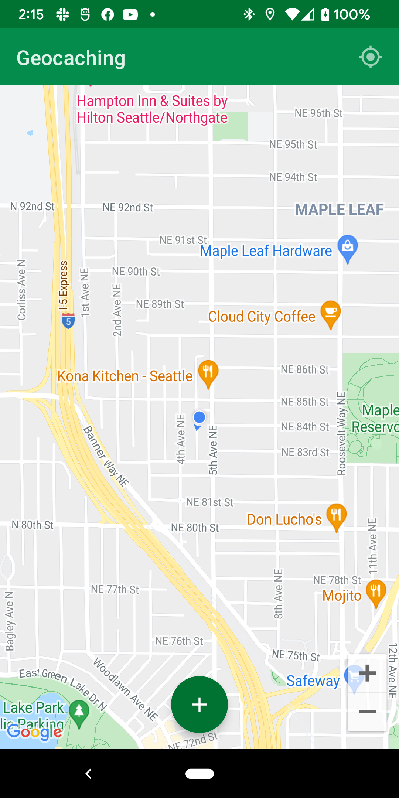
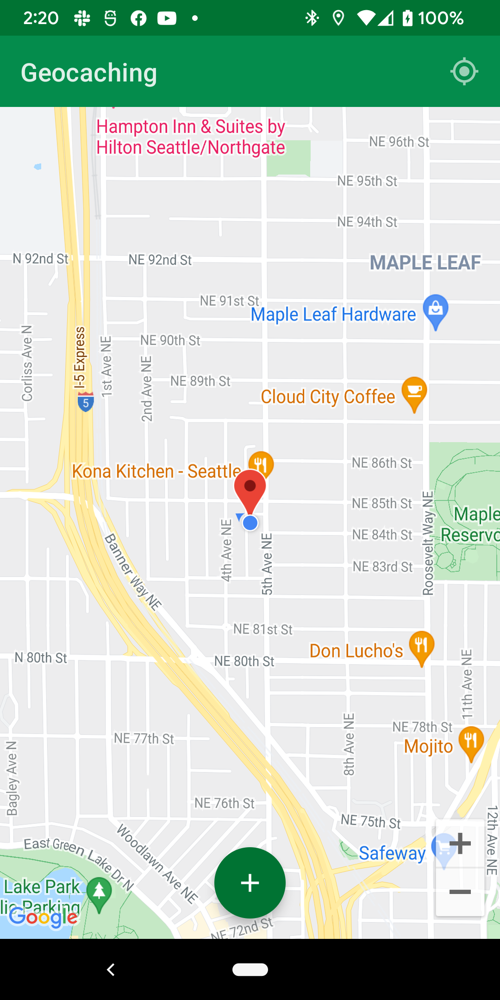

# Geocaching-Android-Coding-Exercise-2

**Author**: Marchael Acode

**Version**: 1.0.0

## Overview

- Android application that uses Google Maps technology to locate user's current location, drop a marker on user's current location, and center camera view to user's current location.

## Setup Instructions

1. Download project files:
   - Google Drive Link: Download project files, unzip files to preferred destination and import into Android Studio.
   - GitHub: Clone this repository and import into Android Studio.
2. Locate `string.xml` file by navigating through `app/res/values`.
3. Within `string.xml` file, input your API key within string named "google_maps_api_key".

## User Stories

- User Story:
    - As a user, I would like to be able to access a global map view.
    - Feature Tasks:
        - Enable Maps SDK for Android in Google Cloud Console.
        - Create Google Maps API Key.
        - Create map view lifecycle and observer composable.
        - Create map view composable and create instance of GoogleMap from mapView.

- User Story:
    - As a user, I would like to be asked permission to use my device's location.
    - Feature Tasks:
        - Add internet, fine and coarse permissions to manifest file.
        - Check if user permission is granted.
        - If user denies location permission, prompt user to change in application settings.
        - If location permission is granted, navigate user to map view screen.

- User Story:
    - As a user, I would like to know my current location within the map view.
    - Feature Tasks:
        - Create function that checks user's location permission is granted.
        - Create function that gets device's location.
        - Create function that retrieves updates of user's current location.

- User Story:
    - As a user, I would like to be able to drop a pin on the map to remember where I parked my car.
    - Feature Tasks:
        - Created action button that places a marker on user's current location.
        - Retrieve and save the coordinates of user's current location into DataStore.
        - Transfer user's current location to marker coordinates to place pin on the map.
        - If button is pressed again, remove old marker with a new marker of user's current location.

- User Story:
    - As a user, I would like to center the map back at my current location.
    - Feature Tasks:
        - Short way: Set ".isMyLocationEnable" of map view instance to true.
        - Long way: Create a menu item button that retrieves user's current location and zooms map on coordinates.

## Wireframes / ScreenShots

- 

- 

- 

- 

- 

- 

## Credit and Collaboration

- [Accompanist Permissions](https://google.github.io/accompanist/permissions/#permissionrequired-and-permissionsrequired-apis)

- [Maps Compose](https://github.com/googlemaps/android-maps-compose)

- [Proto DataStore](https://developer.android.com/topic/libraries/architecture/datastore)

- [Splash Screen API Implementation](https://developer.android.com/guide/topics/ui/splash-screen/migrate)